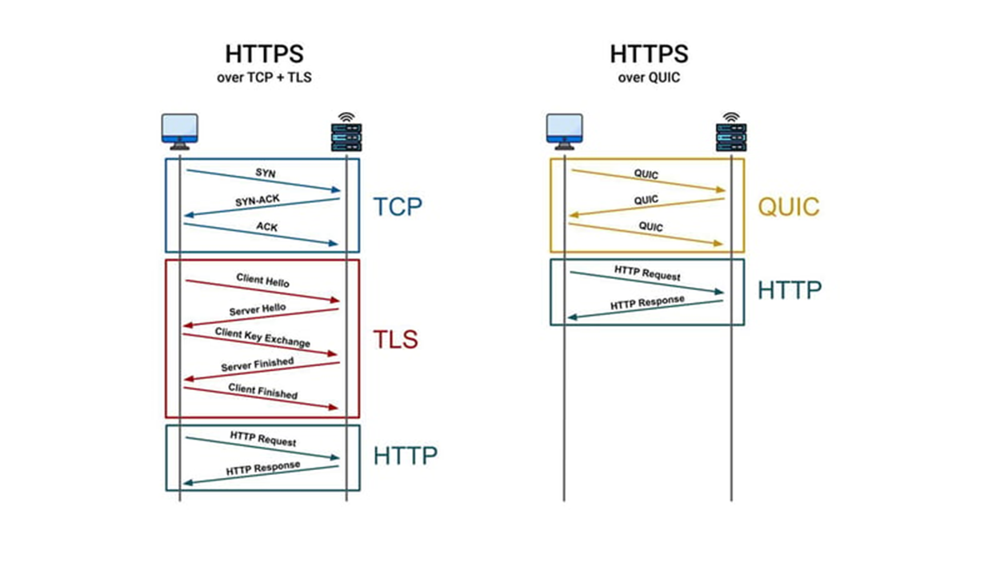

# 🚀 HTTP/2 vs HTTP/3

HTTP/2 and HTTP/3 are both newer versions of the HTTP protocol, designed to make websites load **faster** and more **securely**. However, they work in different ways.

---

## ⚡ HTTP/2

- Uses **TCP (Transmission Control Protocol)** to send data.
- Allows multiple requests to be sent at the same time, but **if one packet is lost, everything slows down** because TCP waits for it to be resent.
- Takes extra time to set up a secure connection due to **two handshakes**:
  - One for **TCP**
  - Another for **TLS (Transport Layer Security)**.

---

## 🚀 HTTP/3

- Uses **QUIC (Quick UDP Internet Connections)**, which is built on **UDP (User Datagram Protocol)**.
- Fixes HTTP/2’s delay issue by allowing packets to be handled **separately** without stopping everything else.
- Has **encryption built-in**, making connections **faster and more secure**.

---

## 🍔 Example: Ordering Food Online

> Imagine you are ordering food from a restaurant online:

🍔 **With HTTP/2 (TCP):**
You order a **burger, fries, and a drink**. The restaurant prepares all three items together.
If the **fries take longer to cook**, you **must wait** for everything before getting your order.

🥤 **With HTTP/3 (QUIC):**
The **burger, fries, and drink** are prepared **separately**. If the **fries take longer**,
you **can still get your burger and drink first**, without waiting.

---

## 🖼️ **Illustration**

From the image above:

### 🔹 HTTP/2:

- Uses **TCP** for connection setup:
  - `SYN → SYN-ACK → ACK` (Three-way handshake)
- Uses **TLS** for encryption, requiring multiple handshake steps:
  - `Client Hello → Server Hello → Client Key Exchange → Server Finished → Client Finished`
- Then, **HTTP** is used for sending requests and receiving responses.

**🔻 Downside:**
🔸 Multiple steps introduce **latency**, making the connection **slower**.

---

## 🔹 HTTP/3:

- **QUIC (built on UDP)** combines **connection setup + encryption** in **fewer steps**.
- Fewer handshake steps result in **faster and more efficient** connections.
- **HTTP requests and responses happen sooner** compared to TCP + TLS.

**✅ Benefit:**
✔ **Lower latency** and **faster page loads**, making web browsing **smoother**.

---

## 🎯 **Key Takeaway**

QUIC is **faster and more efficient** than TCP + TLS because it reduces the number of steps needed for secure communication.
This is why **modern browsers and web services** are increasingly adopting **QUIC**. 🚀🔥
