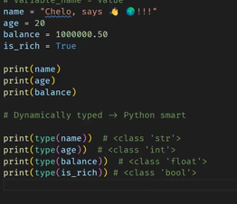

# Day Python Day 3

- Operators part 2
  - `count`
  - `find`
  - `index`
  -
- String Methods
- List Methods
  

```py
print(f"Hello, {name} 🎊")
print(f'"Your age is {age} and height {height}"')
```

## Shortcuts

- Alt + t + For moving lines
  !tab> Boiler plate Code
  win + . + emojis
  ctrl + / + comment
  ctrl + <space> + Auto complete
  ctrl + d Multi cursor (Similar)

* Multi cursor (Similar)

Hold Alt

## Operators 🔢

- Floor Division
  ```py
  floor = 7 // 3
  ```
- Exponention
  ```py
  exponent = 2 ** 3
  ```
- Modulus
  `py
    mod = 3 % 2
    `
  >

>

concatenate - ** cannot mix ** data _types_

str + int

- X

Tables

col 3 is
col 2 is
zebra stripes
zebra sdd

Are

right-aligned
centered
are neat
are ddd

Cool
.:
$1600
$12
$1
$3

## References

- [Markdown sheet cheat](https://ww.markdownguide.org/basic-syntax/#headings)

- [Table](https://github.com/adam-p/markdown-here/wikimarkdown-cheatsheet#tables)

- Strip - remove only leading & trailing characters
