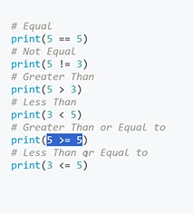

# comparison operator



- all comparison operator and logical operator return a boolean
- bitwise is another example of comparsion operator
- **and**, **or**, **not** are called logic operatos

## `and`

- If any is `False` then `False`
- Only both `True` then `True`

| Operator          |  Output |
| ----------------- | ------: |
| `True and True`   |  `True` |
| ` True and False` | `False` |
| `False and True`  | `False` |
| `False and False` | `False` |

## `or`

- If any is `True` then `True`
- Only both `False` then `False`

| Operator         |  Output |
| ---------------- | ------: |
| `True or True`   |  `True` |
| ` True or False` |  `True` |
| `False or True`  |  `True` |
| `False or False` | `False` |

```
>>> (3 < 4) and (10 >= 5)
True
>>> (5 != 10) or (800 < 5)
True
>>> ( (80 % 5) == 0) and ( (3 * 6) == 35)
False
>>> ( 7 > 5 ) and (4 != 4 ) or (3 <= 10)
True
>>>

```
