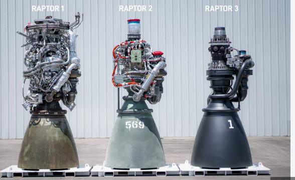
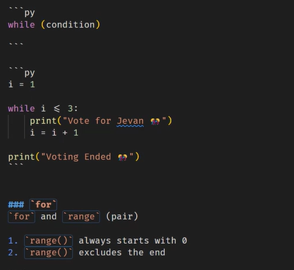

## Day 4 notes

> **Refactoring:** Is the process of improving code quality but not changing the code functionality
>
> - e.g Raptor engines 1,2, 3
>
> 

# Control flow

1. Decision tree
   1. `if..else`
   2. `if..elif..else`
2. Loops
   1. `while`
   2. `for`

## Loops

Purpose: Simply repeating statements

```py
print("Vote for Jevan 🎊")
print("Vote for Jevan 🎊")
print("Vote for Jevan 🎊")
```

### `while`

Executes the statement while the condition is `True`

```py
while (condition)

```

```py
i = 1

while i <= 3:
    print("Vote for Jevan 🎊")
    i = i + 1

print("Voting Ended 🎊")
```

### `for`

`for` and `range` (pair)

1. `range()` always starts with 0
2. `range()` excludes the end
3. `range(start, end, step)`

```py
for i in range(3):
    print(i)
```

## Intro to Git

Motivation: version control for your project. This enables the dev to confident with your change.

1. git init
2. Stage all
3. Provide message - Why? > What?
4. When to commit
   1. Commit at least 3 times in an hour
   2. Logical commit - Complete commit (No bugs)
   3. Small commit - Dont commit >10 files
5. Sync to github (online)



- repitition operator ("\*")

> ## Git
>
> - U means untracted
> - A means added
>   Commit message: should be why you did it.
