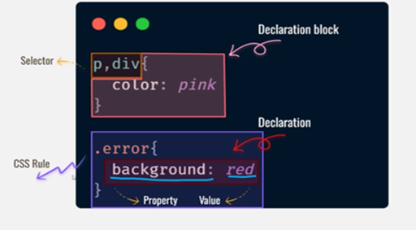

# CSS

- Types of class

1. Inline
2. external
3. internal

Text Styling - I

1. font - size
2. font - weight (boldness)
3. font - style
4. color

Text Styling - II

1. text - transform
2. text - align
3. text - decoration
4. letter - spacing

name
rgb
hexi decimal
HLS - Hue, Saturation, Lightness

padding - pushes inwards
margin - pushes outward.

Box-model

1. content
2. padding
3. border
4. margin
