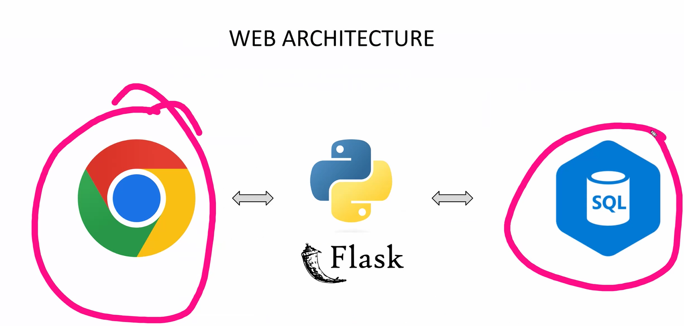
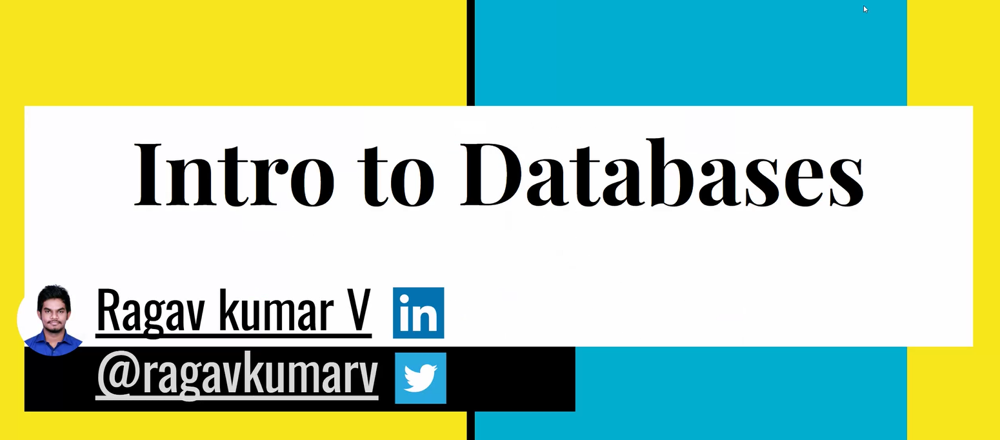
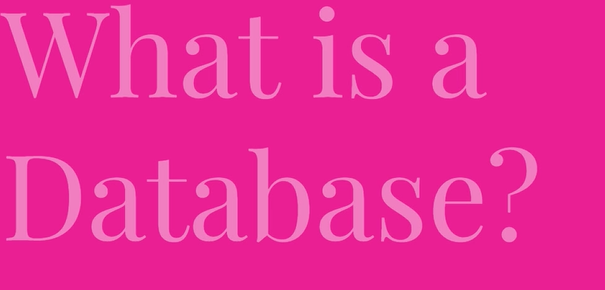
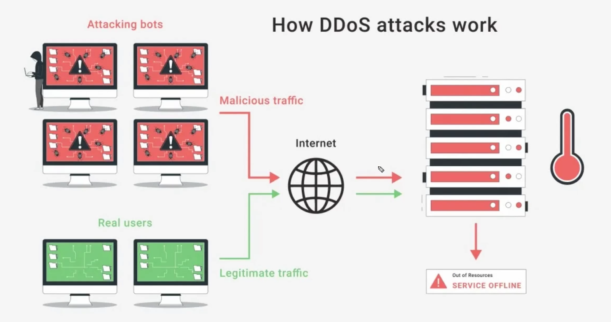

#timing function ease-in-out
transition: 2s all ease in and out

- overflow: hidden;

- ## Semantic elements
- section
- header
- footer
- main
- aside (side bar)

  ### Advantage

  - SEO
  - DX ⬆️
  - visually impaired

## Grid

- grid understands 2D layout but flex doesn't it understands 1D layout
- gap on grid works on the row and columns. (gap: 23px or column-gap: 23px)

- On: Both direction gap
- off:

flex-wrap: wrap reverse;
flex-direction: column;

note: masonry layout

---

Special Software to store data
Whats so special about the software?

hard disk drives(HDD), solid state drives(SSD)
what is cloud?

- Renting PC

different types of cloud providers

- AWS
- Azure
- Google cloud
- IBM Cloud
- Alibaba Cloud
- Oracle
- tencent Cloud

Why is buying to feasible sometimes

- Initial cost is high
- rent room
- Maintance Cost
- cooling systems
- Power bill
- Spares ( Redundate components)
- Generator

If your renting

- Disaster Managment (99.9% guarantee that your data will be online)
- Scaling

  - two types of scalling
  - 1. Vertical scalling ( adding more ram, cpu)
  - 2. Horizontal scalling ( adding more PC's)

- they provide auto-scalling button.
- pay as you go model (paying the for the resources your using)

How to choose: CPU, Chipset, GPU, RAM, HDD

What OS in cloud? Linux
Linux has different flavors: it has distros/Distribution. e.g(ubuntu, openSUSE, Linuxmint, Manjaro, fedora, debian, archlinux, kali-Linux(hacking), alphine linux(256mb))

### Linux

1. Free
2. Open Source (FOSS) - adv ()
3. Secure
4. Small footprint
5. Automation (DevOps handle cloud)

How does DDoS attacks work (Distributed-Denial of Service)

- make use of captcha, if they fail we redirect them.

Database - Why?
