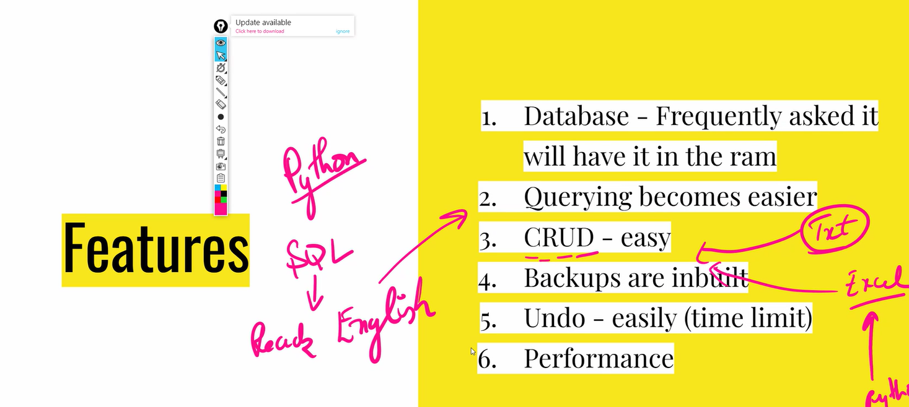
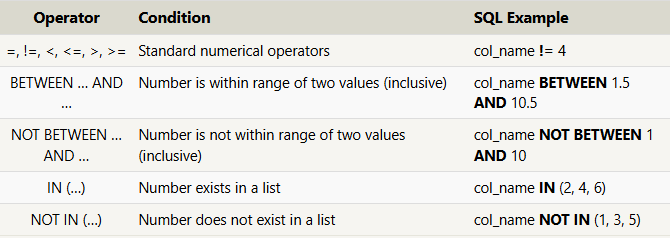

Ram - volatile storage
HDD - Permanent Storage

Database can do it by storing data on the ram if it's being frequently asked.
Loading - Unpacking data from HDD to RAM



There are 2 types of Databases:


> SQL (aka rational database) - make use of tables which are similar to exel

> NoSql(aka no relational database) - make use of documents, something similar to dictionary in python

Types of sql:

- mysql
- plsql (oracle)
- postgres
- Amazon


redis - in memory DB
cassandra - used by netflix

## lesson one (filtering columns)

## Ex 1:

1. Find the title of each film

   ```sql
   Select title
   FROM Movies;

   ```

2. Find the director of each film
   ```sql
    Select director
    FROM Movies;
   ```
3. Find the title and director of each film
   ```sql
    Select title, director
    FROM Movies;
   ```
4. Find the title and year of each film
   ```sql
   Select title, year
   FROM Movies;
   ```
5. Find all the information about each film
   ```sql
   Select *
   FROM Movies;
   ```
   

## SQL Lesson 2: Queries with constraints (Pt. 1) (Row filter)

```sql
SELECT column, another_column, …
FROM mytable
WHERE condition
    AND/OR another_condition
    AND/OR …;
```



Exercise 2 — Tasks

1. Find the movie with a row id of 6
   ```sql
   select * from movies where id = 6;
   ```
2. Find the movies released in the years between 2000 and 2010
   ```sql
   SELECT * FROM movies where year between 2000 and 2010;
   ```
3. Find the movies not released in the years between 2000 and 2010
   ```sql
   SELECT * FROM movies where year not between 2000 and 2010;
   ```
4. Find the first 5 Pixar movies and their release year
   ```sql
   SELECT * FROM movies where id in (1, 2, 3, 4, 5);
   ```
   

## SQL Lesson 3: Queries with constraints (Pt. 2)


Exercise 3 — Tasks

1. Find all the Toy Story movies
   ```sql
   SELECT * FROM movies where title like "Toy Story%" ;
   ```
2. Find all the movies directed by John Lasseter

   ```sql

   ```

3. Find all the movies (and director) not directed by John Lasseter
   ```sql
   SELECT * FROM movies where director != "John Lasseter";
   ```
4. Find all the WALL-\* movies
   ```sql
   SELECT * FROM movies where title like "WALL-_";
   ```
   

## SQL Lesson 4: Filtering and sorting Query results


Exercise 4 — Tasks

1. List all directors of Pixar movies (alphabetically),
   without duplicates

   ```sql
   SELECT DISTINCT director FROM movies
   ORDER BY director ASC;
   ```

2. List the last four Pixar movies released (ordered from most recent to least)
   ```sql
   SELECT title, year FROM movies
   ORDER BY year DESC
   LIMIT 4;
   ```
3. List the first five Pixar movies sorted alphabetically
   ```sql
   SELECT title FROM movies
   ORDER BY title ASC
   LIMIT 5;
   ```
4. List the next five Pixar movies sorted alphabetically
   ```sql
   SELECT title FROM movies
   ORDER BY title ASC
   LIMIT 5 OFFSET 5;
   ```

Exercise 5

1.  List all the Canadian cities and their populations

    ```sql
    SELECT title FROM movies
    ORDER BY title ASC
    LIMIT 5 OFFSET 5;

    ```

2.  Order all the cities in the United States by their latitude from north to south

    ```sql
        SELECT city, latitude FROM north_american_cities
        WHERE country = "United States"
        ORDER BY latitude DESC;
    ```

3.  List all the cities west of Chicago, ordered from west to east

    ```sql
        SELECT city, longitude FROM north_american_cities
    WHERE longitude < -87.629798
    ORDER BY longitude ASC;
    ```

4.  List the two largest cities in Mexico (by population)

        ```SQL
        SELECT city, population FROM north_american_cities
        WHERE country LIKE "Mexico"
        ORDER BY population DESC
        LIMIT 2;
        ```

        ```sql
        select city, population from north_american_cities
        where country like "United States"
        order by population desc
        limit 2 offset 2

        ```

    


> It visualizes how increasing levels of normalization make a database safer from anomalies and inconsistencies
>
> each form is a set of rules we follow.
> if these set of rules are not followed then the database are prone to anamolies

update anamoly - trying to update but something trashes, because of inconsistant data

Why did we separate the table to make our tables safer.


primary key:

1. Unique
2. Not null
3. only one in a table

repeating tools is not permitted

- 
- combining more columns together to make a **composite key**
  

The rules are not meant to be remember but they are meant to be practiced


3rd normal form (non key to non key should not have dependence between each other)

data safety and avoiding anomlies.


common + extra from A
