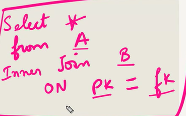

### Forign Keys

What is a friegn key - Helps us to join two tables using their primary key.

- repeatition is allowed.
- can be null




Select Movies.\*, Boxoffice.movie_id

## Exercise 6 — Tasks

1. Find the domestic and international sales for each movie
2.
3. Show the sales numbers for each movie that did better internationally rather than domestically
   ```sql
   SELECT *
   FROM movies JOIN boxoffice
       ON movies.id = boxoffice.movie_id
   WHERE international_sales > domestic_sales;
   ```
4. List all the movies by their ratings in descending order
   ```sql
   select movies.title, boxoffice.rating from movies inner join boxoffice on movies.id = boxoffice.movie_id order by rating desc
   ```

Exercise 7 — Tasks

1. Find the list of all buildings that have employees
   ```sql
   select Distinct building from  Employees
   ```

````
2. Find the list of all buildings and their capacity
```sql
Select * from buildings;
````

3. List all buildings and the distinct employee roles in each building (including empty buildings)
   ```sql
   select distinct building_name, role
   from buildings
   left join employees
       on buildings.building_name = employees.building;
   ```

Exercise 8 — Tasks

1. Find the name and role of all employees who have not been assigned to a building
   ```sql
    select name, role from employees where building is null
   ```
2. Find the names of the buildings that hold no employees
   ```sql
   select building_name from buildings left join employees on building_name = building where name is null
   ```
   Exercise 9 — Tasks
3. List all movies and their combined sales in millions of dollars
   ```sql
    select title, (domestic_sales + international_sales) / 1000000 as millions
    from movies
    join boxofficeon movies.id = boxoffice.movie_id;
   ```
4. List all movies and their ratings in percent
   ```sql
    select title, (rating*10) as percent  from movies join boxoffice where id = movie_id
   ```
5. List all movies that were released on even number years
   ```sql
    SELECT title, year
    FROM movies
    WHERE year % 2 = 0;
   ```

Exercise 10 — Tasks

1. Find the longest time that an employee has been at the studio
   ```sql
    select name, max(years_employed) from employees
   ```
2. For each role, find the average number of years employed by employees in that role
   ```sql
    select role, avg(years_employed) from employees group by role
   ```
3. Find the total number of employee years worked in each building
   ```sql
    select building, sum(years_employed) from employees group by building
   ```

Exercise 11 — Tasks

1. Find the number of Artists in the studio (without a HAVING clause)
   ```sql
    select count(role) from employees where role = 'Artist'
   ```
2. Find the number of Employees of each role in the studio
   ```sql
    select role, count(role) from employees group by rol
   ```
3. Find the total number of years employed by all Engineers
   ```sql
    select sum(years_employed) from employees where role = 'Engineer'
   ```
   Exercise 12 — Tasks
4. Find the number of movies each director has directed

5. Find the total domestic and international sales that can be attributed to each director

## SQL Lesson 12: Order of execution of a Query


Exercise 12 — Tasks

1. Find the number of movies each director has directed
   ```sql
    select director, count(director) from movies group by director
   ```
2. Find the total domestic and international sales that can be attributed to each director
   ```sql
    select director, sum(domestic_sales)+sum(international_sales) as total_amount from movies inner join boxoffice on id=movie_id group by director
   ```
